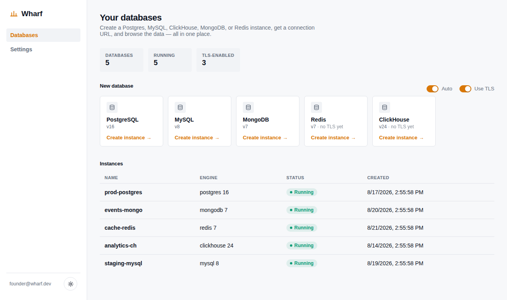
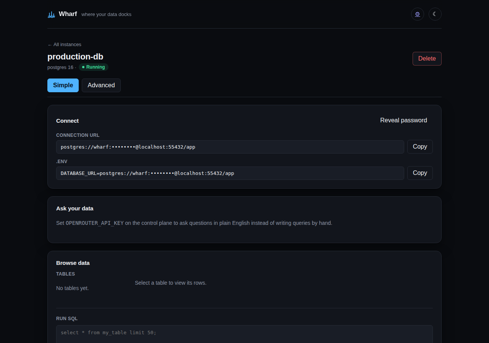

# Wharf

**Where your data docks.** Spin up a database, get a URL, look at your data — in one place, done exceptionally well.

[](./LICENSE)




Open source. Self-host it on your own infrastructure, or run one shared instance and give people accounts on it — same product either way. Every instance adapts to who's looking at it: a **Simple** view (connection URL, `.env` snippet, browse button) by default, an **Advanced** view (metrics, logs, config, backups) one click away — same instance, not two products.



Ships **PostgreSQL, MongoDB, MySQL, Redis, and ClickHouse**, real user accounts, live CPU/memory resize with no restart, CSV/JSON export, and an **Ask your data** natural-language query box backed by [OpenRouter](https://openrouter.ai) with your choice of model. See [`PLAN.md`](./PLAN.md) for the full product plan, the competitive reasoning behind the scope, and an honest go/no-go assessment.

> This repo was previously named `alldb`; the product is now called **Wharf**. The git repository name is unchanged.

## Quickstart (self-host)

Requires Docker and Docker Compose.

```bash
cd deploy
docker compose up --build
```

- Web UI: http://localhost:5173
- API: http://localhost:8080

Open the UI and click a database engine to create an instance — within ~10–30 seconds you'll have a connection URL and a data browser for it.

**Accounts, and the bootstrap window.** Wharf runs in single-user local/dev mode — no login screen — until either `WHARF_TOKEN` is set or the first account signs up. The moment either happens, every other request needs a real session (or the admin token); that's the same instant it becomes safe to point other people at it. There's no separate step to "turn on" auth — signing up the first account *is* the switch.

To enable **Ask your data** (ask a database question in plain English instead of writing SQL/Mongo queries by hand), set `OPENROUTER_API_KEY` on the control plane. Off by default — the UI shows a hint instead of the input box until it's configured. Each signed-in user picks their own model from OpenRouter's live catalog in Settings (or inline per question); there's no single hardcoded model.

## Running a small pilot (letting a few people try it)

1. **Set `WHARF_MAX_INSTANCES`** (e.g. `10`) so one enthusiastic tester can't exhaust the host by creating instances in a loop. On its own this only caps *count* — live resize (below) still lets any single instance grow to 16 cores / 32GB, so also set **`WHARF_MAX_TOTAL_CPU`** (cores) and/or **`WHARF_MAX_TOTAL_MEMORY_MB`** to cap the combined cpu/memory reserved across every instance on the host. Both are enforced on create *and* resize; either is optional and unset means no limit on that dimension.
2. **Have testers sign up for real accounts** rather than sharing one login — each account only sees its own instances (plus anything created before any account existed). Set `WHARF_TOKEN` too if you also want an admin/CLI bypass that can see everything.
3. **Expose it** — the fastest path for a handful of people is a tunnel from a machine you already have (`docker compose up` locally, then `cloudflared tunnel --url http://localhost:5173` or `ngrok http 5173` for a public HTTPS URL), rather than standing up new cloud infra for a short pilot. Set `WHARF_COOKIE_SECURE=true` once it's served over HTTPS so session cookies get the `Secure` flag.

See `PLAN.md` §17 for the full reasoning and what's still deliberately *not* built (billing, org/team accounts, an onboarding flow).

## Local development (without Docker Compose)

Run the control plane directly against your local Docker daemon:

```bash
npm install
npm run dev:control-plane   # http://localhost:8080, needs /var/run/docker.sock
npm run dev:web             # http://localhost:5173, proxies /api to :8080
```

## CLI

```bash
npm install --workspace cli
node cli/bin/wharf.js create postgres
node cli/bin/wharf.js list
node cli/bin/wharf.js url <instance-id>
node cli/bin/wharf.js rm <instance-id>
```

The CLI authenticates as the admin/service account via `WHARF_TOKEN` (`WHARF_API_URL`, default `http://localhost:8080`) — it doesn't have a login flow of its own, and always sees every instance regardless of which user account created it.

## Repository layout

```
control-plane/   API server, SQLite metadata store, Docker provisioner, data-browser adapters, accounts/sessions
web/             React/Vite UI — accounts, Settings, create flow, Simple/Advanced instance views
cli/             `wharf` command-line client (admin/service token)
deploy/          docker-compose.yml self-host quickstart
PLAN.md          product plan, competitive reasoning, roadmap, honest scoring
```

## Status

Postgres, MongoDB, MySQL, Redis, and ClickHouse, single Docker driver — working end to end: create, connect, browse, run queries, live metrics, logs, CSV/JSON export, and live CPU/memory resize (no restart). Backup/restore works for every engine, including Redis and ClickHouse — neither fits the exec-based dump/restore the other three use, so they back up via their protocol client directly (Redis: per-key `DUMP`/`RESTORE`; ClickHouse: schema + `JSONEachRow` data over its HTTP interface). Real user accounts (signup/login/sessions) with per-user instance ownership, plus an admin/service token for the CLI. A real test suite and CI run on every push — real Postgres/MySQL/MongoDB/Redis/ClickHouse containers in CI, not mocks (see `PLAN.md` §18). Confirmed with a real `docker compose up --build` on real hardware, not just in the build sandbox. Not yet built: Kubernetes driver, MCP/AI-agent server, billing, org/team accounts, CLI login. See `PLAN.md` §13–14 for what's deliberately deferred and why.
